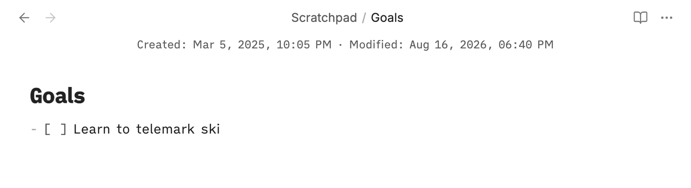

# MetaBar

MetaBar is an Obsidian plugin that displays file creation and modification dates in a small bar above the editor.



## Usage

Enable MetaBar and open a note in edit mode. The bar shows:

- **Created** — the file creation timestamp
- **Modified** — the file modification timestamp

Timestamps follow your system locale and the bar follows your active Obsidian theme.

## Install from source

Clone the repository, install dependencies, and symlink the checkout into your vault:

```sh
git clone https://github.com/eferm/obsidian-metabar.git
cd obsidian-metabar
npm install
ln -s "$PWD" "<vault>/.obsidian/plugins/metabar"
npm run build
```

Reload Obsidian, then enable **MetaBar** under **Settings → Community plugins**.

During active development, `npm run dev` rebuilds `main.js` automatically after source changes.

## Compatibility

MetaBar supports Obsidian 0.16.0 and later.
